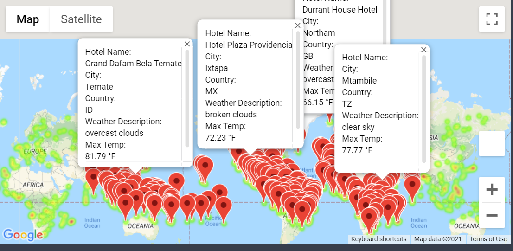
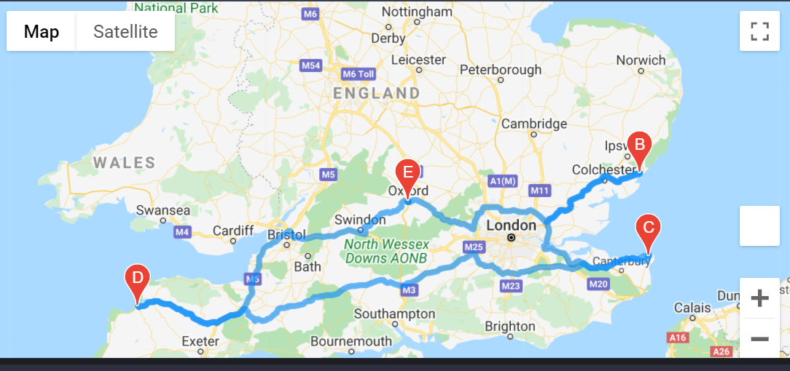

# World Weather Analysis

## Overview
PlanMyTrip is a technology company that specializes in internet related services in the hotel and lodging industry. As a Data Analyst at the company we've been asked to collect and present data for customers via the search page which they will then filter based on their preferred travel criteria in order to find their ideal hotel anywhere in the world. To perform this task we will leverage Jupyter Notebook and the CitiPy data to get the data for more than 500 random latitudes and longitudes of cities and then we will perform requests on the OpenWeatherMap APIs to retreive JSON (Javascript Object Notation) Weather data from these cities. The data will be added to a pandas dataframe where we will use Matplotlib to create a series of relationships between latitude and a variety of weather parameters for over 500 cities around the world. We will need to peform statistical calculations using linear regression on the weather parameters in the northern and southern hemispheres. The data will help my team at PlanMyTrip predict the best time of year for people to plan their vacation. Lastly, we will export the data, clean it and choose the best cities for a vacation based on weather criteria and then map these cities using Jupyter Gmaps and the Google places API.

## Results 
* Utilized NumPy to find 2000 coordinates, utilized citypy module to iterate through the coordinates to find 773 nearest cities. Leveraged the OpenWeatherAPI to retreive data and created a dataframe with city country, latitude, longitude, percent humidity, percent cloudiness, wind speed and weather description

* Uncovered trends, plotting scatterplots comparing City Latitude to Temperature, Humidity, Cloudiness and Wind Speed, and compared Maximum Temperature, Humidity, Cloudiness, Wind Speed between Northern and Southern hemisphere to understand different weather conditions between the two regions

* Filtered cities by a 65 to 85 degrees maximum temperature criteria and employed the Google Places API to find a hotel and lodging options for each city, and finally created a world heatmap for the 371 filtered cities, with a pop up market displaying weather conditions, city, country and hotel name

* Created a sample travel map using the Google Directions API showing the route between 4 cities with driving as model of transportation, along with a pop up marker for each city

